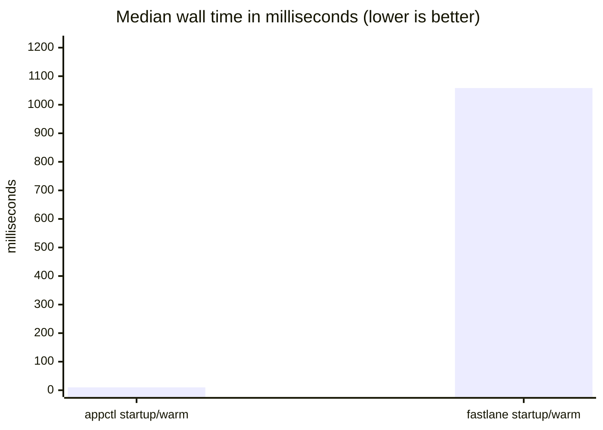

# Benchmarks: appctl vs fastlane

<!-- GENERATED FILE — DO NOT EDIT BY HAND.
     Written by benchmarks/run.sh from the CSVs in benchmarks/results/.
     Regenerate with: ./benchmarks/run.sh --report
     Hand edits are overwritten on the next run. -->

## What this measures

App Store Connect API operations and process startup — the work appctl actually does.
Every figure below is a median over repeated runs of the same command on the same
machine. Where a scenario talks to the API, both tools authenticate against the
same account with the same key, so the comparison isolates the client.

## What this does not measure

**appctl is not faster than fastlane at building or signing, because appctl does not
build or sign.** It has no compilation step, no code signing, no `gym`, no `match`,
no ipa upload. If your bottleneck is a Swift compile or a provisioning profile
round trip, nothing here applies to you and appctl will not help.

What appctl replaces is the App Store Connect metadata and release surface —
querying apps, builds, versions, TestFlight groups, reviews — plus the fixed cost
of starting a tool at all, which every invocation pays whether or not it does
any real work. Those are the only things measured here.

The comparison is also fastlane-only by policy: no other App Store Connect client,
no raw `curl` baseline, no appctl-vs-older-appctl. See the header of `run.sh`.

## Dependency footprint

Full transitive closure — what an install actually pulls down, not the direct
dependency count each manifest happens to list.

| | appctl | fastlane |
|---|---|---|
| Packages installed | 3 SwiftPM | 101 Ruby gems |

Counted by `swift package show-dependencies --format flatlist` and `bundle list`
against the pinned `Gemfile.lock`, recorded per run in `results/`.

## Results

### Wall time

Median, lower is better.

| Scenario | Cache | appctl | fastlane | Difference |
|---|---|---|---|---|
| Process startup (version query) | warm | 10.0 ms | 1.06 s | appctl 106× faster |
| List all apps (App Store Connect API) | — | not yet measured | not yet measured | not yet measured |

### Peak memory

Maximum resident set size, lower is better.

| Scenario | Cache | appctl | fastlane | Difference |
|---|---|---|---|---|
| Process startup (version query) | warm | 7.9 MB | 93.1 MB | appctl 12× less |
| List all apps (App Store Connect API) | — | not yet measured | not yet measured | not yet measured |

**Process startup (version query).** Launch to first output with no network work. This is the floor cost paid by every single invocation.

**List all apps (App Store Connect API).** Authenticate and fetch every app visible to the API key, paginated to completion.

### Chart



## Environment

Every run records the machine it ran on. Numbers from different rows above may come
from different runs; the run each scenario came from is listed here.

| Run | Date (UTC) | macOS | Chip | Swift | fastlane | Cache | Samples |
|---|---|---|---|---|---|---|---|
| `20260821T120531Z-arm64` | 2026-08-21 12:05:31 | macOS 26.5 (25F71) | arm64 Apple M5 Pro | 6.4 | 2.238.0 | warm | 30 |

## Method

- Wall time is read from the shell's own `$EPOCHREALTIME` (microsecond resolution)
  with nothing but the command under test inside the timed window. `/usr/bin/time`
  is not used for timing: it adds a fork and resolves only to 10ms, which is the
  same order of magnitude as appctl's entire startup.
- Peak memory is collected in a separate pass via `/usr/bin/time -l`, so its
  overhead never lands inside a wall-time sample. That pass runs after the wall
  samples, so on a `cold` row the memory figure was itself taken warm — peak RSS
  barely moves with cache state, but the row is not cold in the way its label
  suggests.
- Each scenario runs warmup iterations that are discarded, then the recorded
  samples. Reported values are medians, never best-of.
- appctl is measured from `.build/release/appctl`. Debug builds are refused.
- fastlane's update check is disabled, which favours fastlane: leaving it on
  would time a network round trip to rubygems rather than fastlane itself.
- The fastlane lane calls Spaceship in-process rather than shelling out, so no
  extra process launch is charged against it.

These are wall-clock measurements on a developer machine, not an isolated rig.
A busy machine can move fastlane's startup median by 3× between runs, which is
why the medians are quoted to two significant figures at most and why every
individual sample is committed rather than just the summary. Treat the order of
magnitude as the result and the exact figure as incidental.

### Warm vs cold

`warm` means warmup iterations ran first and were discarded — what a repeat
invocation on a machine already using the tool looks like. `cold` means
`--cold-cache` skipped the warmup, so the samples pay for faulting the binary,
its libraries and (for fastlane) its gems in from disk.

The distinction matters most for fastlane, whose startup faults in several hundred
gem files that a warm filesystem cache already holds. CI runners on fresh
containers get the cold number; a laptop mid-session gets the warm one. Compare
rows within a cache state, never across.

`--cold-cache` only skips this harness's own warmup. It cannot evict a cache
already populated by an earlier run, so a genuinely cold measurement means
running it as the first thing after a reboot. Rows recorded that way are
labelled `cold` on trust, not on proof.

## Reproducing

From a clean clone, with Xcode 26 / Swift 6.2 or newer and Ruby with bundler installed:

```bash
swift build -c release
./benchmarks/run.sh                 # startup scenarios; installs pinned fastlane on first run

# For the API scenarios, both tools need the same credentials:
export APPCTL_KEY_ID=...           # from your .appctl.toml [auth] section
export APPCTL_ISSUER_ID=...
export APPCTL_PRIVATE_KEY_PATH=...
./benchmarks/run.sh
```

Each invocation writes a new CSV to `results/` and regenerates this file from
**all** committed CSVs, so adding the API scenarios later does not disturb the
startup numbers already recorded. `./benchmarks/run.sh --report` regenerates this
file from existing results without measuring anything.

Raw samples — every individual iteration, not just the medians — are committed in
[`results/`](results/) so the medians above can be recomputed or disputed.
